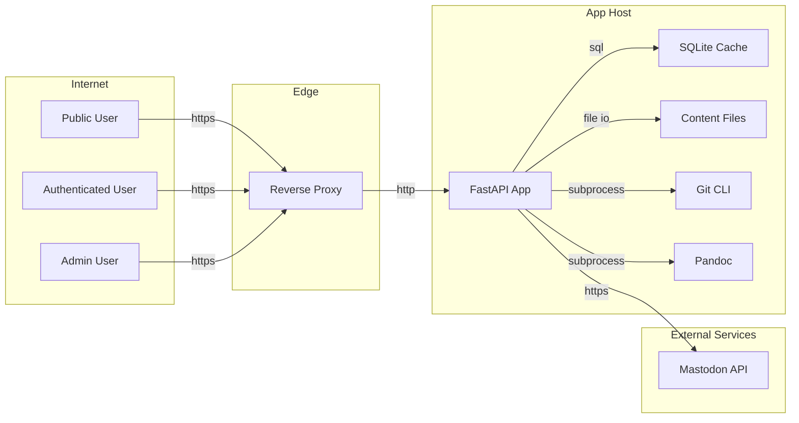

## Executive summary
AgBlogger has solid baseline controls for an internet-exposed app (auth cookies with CSRF checks, runtime config guardrails, path traversal protections, and HTML sanitization), but the highest residual risk is account or session abuse leading to integrity-impacting actions. The top priorities are strengthening auth abuse resistance (distributed rate limits), tightening authorization consistency on mutating endpoints, and reducing XSS/active-content and render-path DoS exposure around markdown rendering and content serving.

## Scope and assumptions
- In scope:
  - `backend/api/`
  - `backend/services/`
  - `backend/pandoc/`
  - `backend/filesystem/`
  - `backend/models/`
  - `backend/main.py`
  - `backend/config.py`
  - `frontend/src/api/client.ts`
  - `frontend/src/pages/PostPage.tsx`
  - `frontend/src/pages/SearchPage.tsx`
  - `frontend/src/hooks/useKatex.ts`
  - `docker-compose.yml`
  - `Caddyfile`
- Out of scope:
  - Host OS hardening, container runtime hardening, cloud/network ACLs not defined in repo.
  - Third-party service-side controls (for example Mastodon instance security posture).
  - Non-production local debug workflows.
- Assumptions (validated with user context):
  - Deployment is internet-exposed in production.
  - Primary data is public blog content.
  - Current operating mode is single-tenant.
  - AuthN/AuthZ expectation: admin-only post mutation is intended (implemented in `backend/api/posts.py`).

Open questions that would materially change ranking:
- Will non-admin accounts exist in production (invited editors/readers), or only a single admin account?
- Will deployment run one API instance or multiple horizontally scaled instances?
- Is an outbound egress firewall enforced for the app container/host?

## System model
### Primary components
- Reverse proxy and TLS edge: Caddy in front of app (`Caddyfile`, `docker-compose.yml`).
- API server: FastAPI app with middleware for CORS, trusted hosts, CSRF, and security headers (`backend/main.py:create_app`).
- Auth and identity: JWT access tokens, hashed refresh tokens, PATs, invite codes (`backend/api/auth.py`, `backend/services/auth_service.py`, `backend/models/user.py`).
- Content plane: markdown/TOML on filesystem as source of truth + SQLite cache/FTS (`docs/ARCHITECTURE.md`, `backend/filesystem/content_manager.py`, `backend/models/post.py`).
- Rendering pipeline: Pandoc subprocess + custom HTML sanitizer + frontend HTML injection points (`backend/pandoc/renderer.py`, `frontend/src/pages/PostPage.tsx`, `frontend/src/pages/SearchPage.tsx`).
- External integrations: outbound Mastodon API calls (`backend/crosspost/mastodon.py`, `backend/services/crosspost_service.py`).

### Data flows and trust boundaries
- Internet -> Reverse Proxy -> API Server
  - Data: HTTP requests (auth, content reads, admin mutations).
  - Protocol: HTTPS at edge, HTTP reverse-proxied to app.
  - Security guarantees: trusted host allowlist and runtime config checks (`backend/main.py:195`, `backend/config.py:73`).
  - Validation/enforcement: FastAPI routing + Pydantic request schemas across endpoints (`backend/schemas/*.py`).
- Browser -> Auth endpoints (`/api/auth/*`)
  - Data: username/password, refresh token, JWT cookies, CSRF token.
  - Protocol: HTTP(S) JSON + cookies.
  - Security guarantees: login origin enforcement, CSRF middleware for unsafe methods, `HttpOnly`/`SameSite=strict` cookies (`backend/api/auth.py:116`, `backend/main.py:198`, `backend/api/auth.py:61`).
  - Validation/enforcement: `LoginRequest`/`RegisterRequest` constraints and auth checks (`backend/schemas/auth.py`, `backend/api/deps.py`).
- Browser (public) -> Post/content read endpoints
  - Data: public rendered HTML, excerpts, static content files.
  - Protocol: HTTP(S).
  - Security guarantees: draft access checks and path constraints on content serving (`backend/api/posts.py:354`, `backend/api/content.py:24`).
  - Validation/enforcement: file path prefix + traversal checks + DB draft ownership checks (`backend/api/content.py:21`, `backend/api/content.py:57`).
- Authenticated user -> Mutating API surfaces
  - Data: label updates, crosspost account credentials, render preview markdown.
  - Protocol: HTTP(S) JSON.
  - Security guarantees: endpoint-level dependency checks (`require_auth`/`require_admin`) (`backend/api/deps.py:76`, `backend/api/deps.py:89`).
  - Validation/enforcement: Pydantic models and explicit role checks in route dependencies.
- API Server -> Filesystem and Git subprocess
  - Data: post files, assets, labels/site TOML, git history.
  - Protocol: local file I/O + subprocess.
  - Security guarantees: safe-path resolution with `is_relative_to` and constrained relative paths (`backend/filesystem/content_manager.py:99`, `backend/api/sync.py:41`).
  - Validation/enforcement: path normalization/traversal rejection and endpoint auth gating.
- API Server -> Pandoc subprocess
  - Data: markdown content and rendered HTML.
  - Protocol: local subprocess stdin/stdout.
  - Security guarantees: subprocess timeout and post-render sanitizer (`backend/pandoc/renderer.py:187`, `backend/pandoc/renderer.py:167`).
  - Validation/enforcement: custom allowlist HTML sanitizer + URL scheme filtering.
- API Server -> External Mastodon instances
  - Data: OAuth-like bearer token and post content.
  - Protocol: outbound HTTPS via `httpx`.
  - Security guarantees: normalized HTTPS-only instance URL and public-host checks (`backend/crosspost/mastodon.py:60`, `backend/crosspost/mastodon.py:33`).
  - Validation/enforcement: reject localhost/private/non-public resolution before requests.
- API Server -> SQLite cache DB
  - Data: users, tokens, post cache/FTS, sync manifests, crosspost metadata.
  - Protocol: async SQLAlchemy (`aiosqlite`).
  - Security guarantees: ORM parameterization and hashed token storage (`backend/services/auth_service.py:53`, `backend/models/user.py:61`).
  - Validation/enforcement: schema constraints + service-layer checks.

#### Diagram

## Assets and security objectives
| Asset | Why it matters | Security objective (C/I/A) |
|---|---|---|
| Admin account and admin session | Controls all post CRUD, sync, site config and password operations | C, I |
| Access/refresh tokens and PATs | Enable authenticated API access and automation | C, I |
| Password hashes and invite codes | Protect account onboarding and login resilience | C, I |
| Markdown posts and page files | Canonical content source; defacement harms trust | I, A |
| `labels.toml` taxonomy | Drives classification and content discovery semantics | I |
| Rendered HTML cache (`PostCache.rendered_html`) | User-facing content directly rendered in browser | I |
| Crosspost credentials (`social_accounts.credentials`) | Allows posting to external social accounts | C, I |
| Sync/git state and manifest | Supports conflict resolution and content consistency | I, A |
| API/service availability | Required for blog reads and admin operations | A |

## Attacker model
### Capabilities
- Unauthenticated internet attacker can access public routes and auth endpoints.
- Can perform credential stuffing and brute-force attempts against login/refresh routes.
- Can send crafted markdown/queries/uploads where endpoints permit it.
- If holding any valid account, can call `require_auth` endpoints (labels, crosspost, preview render).
- Can attempt SSRF via externally configurable Mastodon instance URL input.

### Non-capabilities
- No assumed shell/host compromise, no direct filesystem access.
- No assumed database write/read outside app-mediated paths.
- No assumed ability to bypass TLS or reverse-proxy controls.
- No assumed multi-tenant lateral movement because current mode is single-tenant.

## Entry points and attack surfaces
| Surface | How reached | Trust boundary | Notes | Evidence (repo path / symbol) |
|---|---|---|---|---|
| `/api/auth/login`, `/api/auth/refresh`, `/api/auth/logout` | Internet HTTP(S) | Internet -> API | Credential and token handling; rate-limited with in-memory limiter | `backend/api/auth.py:163`, `backend/api/auth.py:269`, `backend/services/rate_limit_service.py:9` |
| Cookie/CSRF middleware | All unsafe `/api/*` requests | Browser -> API | CSRF check enforced for cookie-auth unsafe methods | `backend/main.py:198` |
| `/api/posts` read/search/get | Internet HTTP(S) | Internet -> API | Public content read and search surface | `backend/api/posts.py:96`, `backend/api/posts.py:151`, `backend/api/posts.py:354` |
| `/api/posts` create/update/delete/upload/assets/edit | Authenticated admin HTTP(S) | Admin -> API | Post mutation restricted to `require_admin` | `backend/api/posts.py:171`, `backend/api/posts.py:379`, `backend/api/posts.py:465`, `backend/api/posts.py:604` |
| `/api/labels` create/update/delete | Authenticated user HTTP(S) | Auth user -> API | Mutating taxonomy currently requires auth but not admin | `backend/api/labels.py:79`, `backend/api/labels.py:120`, `backend/api/labels.py:167` |
| `/api/content/{path}` | Internet HTTP(S) | Internet -> filesystem via API | Path normalization and draft access controls | `backend/api/content.py:24`, `backend/api/content.py:57` |
| `/api/render/preview` | Authenticated HTTP(S) | Auth user -> pandoc subprocess | User-provided markdown rendered by Pandoc | `backend/api/render.py:24`, `backend/pandoc/renderer.py:184` |
| `/api/sync/*` | Authenticated admin HTTP(S) | Admin -> filesystem/git via API | Upload/download/commit can mutate files and git state | `backend/api/sync.py:120`, `backend/api/sync.py:161`, `backend/api/sync.py:200` |
| `/api/crosspost/*` | Authenticated HTTP(S) | Auth user -> external HTTP | Stores encrypted creds, performs outbound requests | `backend/api/crosspost.py:37`, `backend/services/crosspost_service.py:27`, `backend/crosspost/mastodon.py:60` |
| Frontend HTML render sinks | Browser rendering | API data -> browser DOM | Uses `dangerouslySetInnerHTML` after backend sanitization | `frontend/src/pages/PostPage.tsx:169`, `frontend/src/pages/SearchPage.tsx:124`, `backend/pandoc/renderer.py:167` |

## Top abuse paths
1. Account takeover via auth spraying
   1. Attacker enumerates usernames and performs distributed login attempts.
   2. In-memory limiter is bypassed across multiple sources or instances.
   3. Admin account is compromised.
   4. Attacker modifies/deletes posts and settings.
2. Low-privileged user defaces taxonomy
   1. Attacker obtains a valid non-admin account.
   2. Calls label create/update/delete endpoints guarded only by `require_auth`.
   3. Corrupts labels graph and category mapping.
   4. Public content discovery and integrity are degraded.
3. Render-path availability exhaustion
   1. Authenticated user repeatedly calls `/api/render/preview` with large/complex markdown.
   2. Pandoc subprocesses consume CPU and hit timeout under load.
   3. API latency and availability degrade for legitimate traffic.
4. Stored-XSS chain via sanitizer bypass
   1. Attacker with content-write ability stores crafted markdown/HTML payload.
   2. Payload survives custom sanitizer or abuses active same-origin content.
   3. Payload executes through frontend HTML sinks.
   4. Attacker performs authenticated actions in victim browser context.
5. SSRF through crosspost instance control
   1. Authenticated attacker submits crafted Mastodon `instance_url`.
   2. Host validation is bypassed or raced (DNS change/rebinding scenario).
   3. Server sends outbound requests to sensitive internal destinations.
   4. Internal metadata/services are probed.
6. Production misconfiguration exploitation
   1. Deployment accidentally runs with weak config (e.g., debug mode, weak secret, bad host trust).
   2. Attacker abuses exposed docs, token forgery conditions, or host header ambiguity.
   3. Confidentiality/integrity impact on auth and control plane.
7. Incident stealth via weak audit trails
   1. Attacker (or insider) performs sensitive changes through valid credentials.
   2. Logs lack complete immutable security audit context.
   3. Detection and forensics are delayed.

## Threat model table
| Threat ID | Threat source | Prerequisites | Threat action | Impact | Impacted assets | Existing controls (evidence) | Gaps | Recommended mitigations | Detection ideas | Likelihood | Impact severity | Priority |
|---|---|---|---|---|---|---|---|---|---|---|---|---|
| TM-001 | Internet attacker | Can reach auth endpoints; has username list | Credential stuffing/distributed brute force against login | Account compromise, including potential admin takeover | Admin session, tokens, content integrity | Login/refresh rate checks and failure tracking (`backend/api/auth.py:134`, `backend/services/rate_limit_service.py:9`) | Limiter is in-memory per-process and reset on restart; no MFA | Move auth rate limiting to shared backend (Redis), add per-account lock heuristics, add optional MFA for admin | Alert on `401/429` spikes by username/IP ASN; track impossible travel | medium | high | high |
| TM-002 | Authenticated low-priv user | Valid account (invite/self-register scenario) | Modify labels via non-admin routes | Taxonomy defacement and integrity loss | `labels.toml`, classification integrity, user trust | Auth required on routes (`backend/api/labels.py:85`, `backend/api/labels.py:127`, `backend/api/labels.py:173`) | No admin-only guard for label mutation | Require `require_admin` (or explicit label-editor role) for create/update/delete; add ownership/approval model if needed | Audit log actor + diff for each label mutation; alert on bulk changes | medium (low in current single-admin operation) | medium | medium |
| TM-003 | Authenticated content writer / compromised admin | Can submit markdown/content rendered to HTML | Stored XSS via sanitizer bypass or active content pivot | Session abuse, unauthorized actions, site defacement | Authenticated sessions, rendered HTML integrity | Custom allowlist sanitizer + URL scheme checks (`backend/pandoc/renderer.py:167`, `backend/pandoc/renderer.py:71`), CSP header (`backend/main.py:235`) | Custom sanitizer is hard to verify; frontend injects HTML via `dangerouslySetInnerHTML`; CSP allows self-hosted scripts | Replace/augment sanitizer with hardened library, add regression corpus for XSS payloads, disallow serving `text/html` from user content paths, tighten CSP with reporting | CSP violation reporting, monitor suspicious DOM/script errors and high-risk payload markers | low to medium | high | high |
| TM-004 | Authenticated user | Valid account | DoS by spamming `/api/render/preview` with heavy markdown | API slowdown and degraded availability | API availability, CPU budget | Input max length and pandoc timeout (`backend/api/render.py:17`, `backend/pandoc/renderer.py:201`) | No endpoint rate limit/concurrency quotas; expensive subprocess path is synchronous per request lifecycle | Add per-user/IP rate limiting on render endpoint, queue/subprocess concurrency cap, cache render-by-hash, lower max size/time budget | Alert on render endpoint p95 latency, timeout count, and subprocess concurrency | medium | medium | medium |
| TM-005 | Authenticated user | Can create social account and trigger crosspost | SSRF attempt via crafted Mastodon instance URL | Internal network probing/data exposure | Internal network boundaries, service metadata | URL normalization to HTTPS + public-host/IP checks (`backend/crosspost/mastodon.py:60`, `backend/crosspost/mastodon.py:33`) | DNS TOCTOU/rebinding not fully eliminated; no explicit egress deny policy in repo | Enforce outbound egress allowlist/firewall, re-verify resolved IP at connect time, log resolved IPs per request | Alert on outbound attempts to private/link-local/reserved ranges | low | medium | medium |
| TM-006 | XSS-capable attacker | Must achieve script execution in origin | Steal/reuse CSRF token from localStorage and perform unsafe requests with cookies | Full victim action execution in app | Session integrity, protected mutating actions | HttpOnly auth cookies + CSRF comparison + SameSite strict (`backend/api/auth.py:61`, `backend/main.py:198`), client sets header (`frontend/src/api/client.ts:58`) | CSRF token persisted in localStorage and mirrored in response headers (`frontend/src/api/client.ts:25`, `backend/main.py:228`) | Keep CSRF token memory-only where feasible, rotate token on refresh/login, strengthen XSS defenses and CSP reporting | Detect unusual unsafe-method bursts per session and inconsistent user-agent patterns | low | high | medium |
| TM-007 | External attacker exploiting config mistakes | Production deployment deviates from secure defaults | Abuse weak secrets/debug/trusted-host misconfig | Token forgery, host-header abuse, expanded attack surface | Auth artifacts, request routing integrity | Startup validation in non-debug for secret/admin/trusted_hosts (`backend/config.py:73`, `backend/main.py:93`) | If debug is enabled in production, guardrails are bypassed; deployment policy not enforced in code | Add deployment policy checks in CI/CD (deny `DEBUG=true`), runtime startup assert for internet mode, config conformance tests | Monitor startup config logs and continuously scan deployed env vars/settings | low | high | medium |
| TM-008 | Insider or compromised account | Valid credentials | Perform sensitive actions with limited forensic trail | Delayed detection and response | Auditability, incident response capability | Some logging and git commit traces (`backend/services/git_service.py:69`, `backend/api/sync.py:231`) | No comprehensive immutable audit trail with actor/IP/action/object/result for all sensitive endpoints | Add structured audit events for auth/admin/content/sync operations and ship to append-only sink | Alert on high-risk event sequences (password change + mass delete + sync commit) | medium | medium | medium |

## Criticality calibration
For this internet-exposed, public-content, single-tenant blog platform:
- `critical`
  - Remote unauthenticated path to admin takeover.
  - Remote unauthenticated RCE or arbitrary file write outside content boundary.
  - Systematic token forgery due exposed/weak signing key in production.
- `high`
  - Admin-account compromise via feasible auth abuse.
  - Stored XSS enabling authenticated action execution in admin browser.
  - Unauthorized mutation/deletion of canonical content at scale.
- `medium`
  - Authenticated-user DoS against expensive render/sync paths.
  - Integrity-impacting but scoped abuse (e.g., label graph tampering).
  - SSRF attempts with partial guardrails and uncertain egress controls.
- `low`
  - Minor information disclosure from non-sensitive metadata.
  - Issues requiring unrealistic prerequisites (host compromise first).
  - Best-practice gaps with strong compensating controls and low exploitability.

## Focus paths for security review
| Path | Why it matters | Related Threat IDs |
|---|---|---|
| `backend/api/auth.py` | Core auth flow, cookies, origin checks, and rate-limit hooks | TM-001, TM-006, TM-007 |
| `backend/services/rate_limit_service.py` | In-memory limiter design constrains brute-force resistance | TM-001 |
| `backend/api/deps.py` | Central authN/authZ dependency logic and role gating | TM-002 |
| `backend/api/labels.py` | Mutating label routes currently permit any authenticated user | TM-002 |
| `backend/api/posts.py` | High-impact content mutation endpoints and admin controls | TM-003, TM-008 |
| `backend/pandoc/renderer.py` | Custom sanitizer and subprocess rendering boundary | TM-003, TM-004 |
| `frontend/src/pages/PostPage.tsx` | HTML injection sink (`dangerouslySetInnerHTML`) | TM-003 |
| `frontend/src/pages/SearchPage.tsx` | Additional HTML injection sink for excerpts | TM-003 |
| `frontend/src/api/client.ts` | CSRF token persistence and refresh retry behavior | TM-006 |
| `backend/api/content.py` | Public file serving and draft/path access checks | TM-003 |
| `backend/api/render.py` | Authenticated rendering endpoint with costly processing | TM-004 |
| `backend/crosspost/mastodon.py` | Outbound URL normalization and SSRF-relevant host checks | TM-005 |
| `backend/services/crosspost_service.py` | Credential decrypt/use flow and external-post execution path | TM-005 |
| `backend/config.py` | Runtime security validation and production guardrails | TM-007 |
| `backend/main.py` | Middleware ordering, CSRF enforcement, security headers | TM-006, TM-007 |

## Quality check
- Covered entry points discovered in backend routers and frontend render sinks.
- Mapped each trust boundary to at least one abuse path/threat.
- Distinguished runtime surfaces from deployment/CI assumptions.
- Incorporated user clarifications: internet-exposed, public content, single-tenant.
- Kept explicit assumptions and listed open questions that can change priority.
